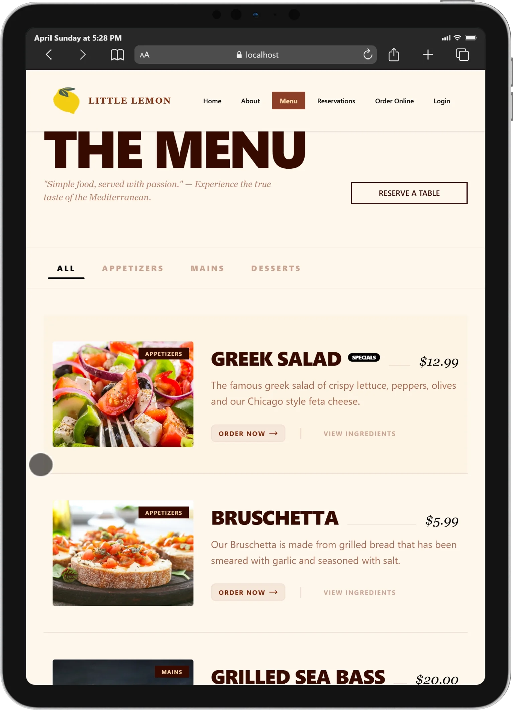
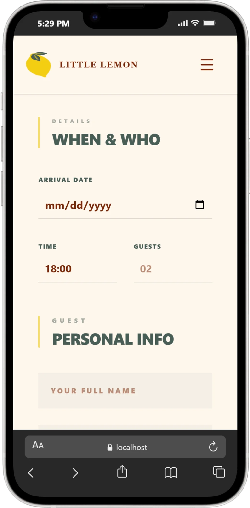
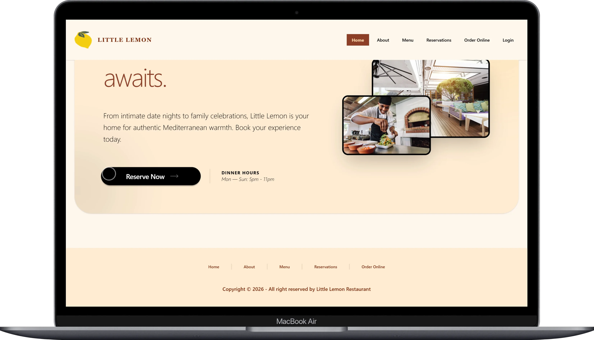

# 🍋 LITTLE LEMON | MODERN ORDERING SYSTEM

A high-contrast, minimalist food ordering application designed with engineering rigor. This project focuses on a clean, industrial aesthetic and a seamless user experience using a strictly typed modern stack.

---

## 📸 SCREENSHOTS

  <table width="100%">
    <tr>
      <td width="50%">
        
<b>Ipad</b>

        
      </td>
    </tr>

    <tr>
        <td width="50%">
        
<b>Iphone</b>

        
        </td>
    </tr>

    <tr>
        <td width="50%">
        
<b>Macbook</b>

        
        </td>
    </tr>

  </table>

---

## 🛠 TECH STACK

- **Frontend:** React + TypeScript
- **Styling:** Tailwind CSS (Custom Industrial Theme)
- **State Management:** React Hooks
- **Forms:** React Hook Form + Yup Validation
- **Icons:** Lucide React
- **Build Tool:** Vite

---

## 🚀 KEY FEATURES

- **Earthy High-Contrast UI:** Custom-engineered components utilizing the Caramellatte theme—a sophisticated blend of deep charcoal (#495E57) and vibrant brand-yellow (#F4CE14) optimized for modern display standards.
- **Dynamic Bag Management:** Real-time state updates for adding and removing items with automated subtotaling.
- **Schema-Based Validation:** Robust login and form handling using Yup to ensure data integrity.
- **Strict Typing:** 100% TypeScript coverage for props, state, and utility functions.
- **Responsive Geometry:** Hard-edged, blocky design language that adapts perfectly to any screen size.

---
